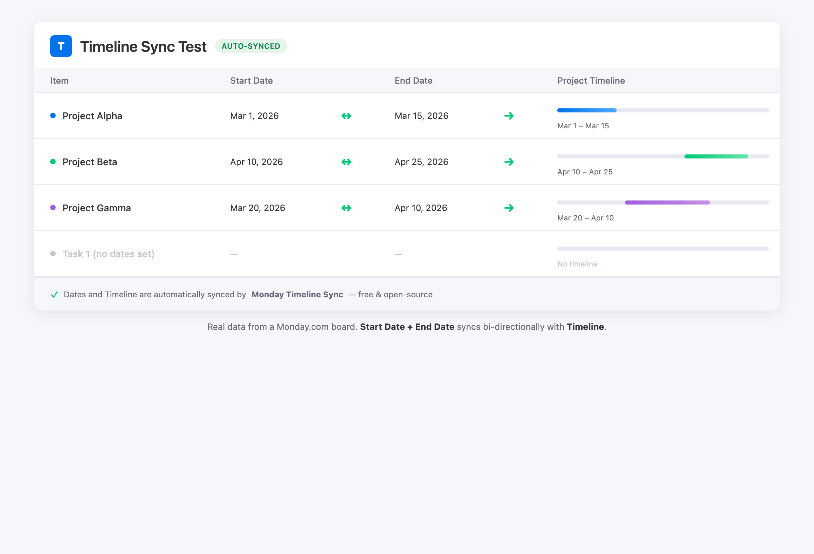
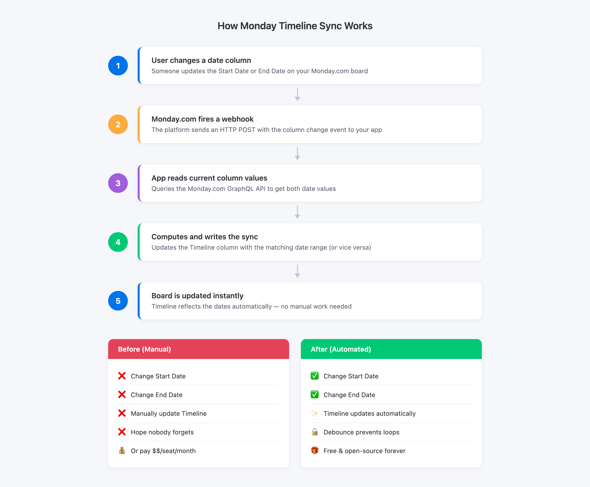

# Monday Timeline Sync

**Free, open-source Monday.com app that automatically syncs Start Date + End Date columns with Timeline columns.**

No more manual copy-paste. No paid marketplace apps. Deploy in 5 minutes.

[](LICENSE)
[](https://render.com/deploy?repo=https://github.com/spcaeo/monday-timeline-sync)

---

## See It In Action



*Real Monday.com board data — Start Date + End Date automatically synced with Timeline column.*

---

## The Problem

Monday.com has **no native automation** to sync separate Start Date and End Date columns with a Timeline column. The marketplace app "Start + End = Timeline" charges per seat. Many teams just need a simple, free solution.

This app solves that. It's:

- **Free forever** -- MIT licensed, self-hosted
- **One-click deploy** -- Render.com (free) or Cloudflare Workers (free)
- **Bi-directional** -- dates to timeline AND timeline to dates
- **Zero maintenance** -- set it and forget it

## How It Works



## Features

- **Bi-directional sync** -- Change dates, timeline updates. Change timeline, dates update.
- **One-way modes** -- dates-to-timeline only, or timeline-to-dates only
- **Multi-board** -- Configure as many boards as you need
- **Loop prevention** -- Smart debounce prevents infinite update cycles
- **Column validation** -- Verifies your column IDs exist before activating
- **Two deploy options** -- Cloudflare Workers (edge, fast) or Render.com (simple)
- **Lightweight** -- Built on [Hono](https://hono.dev) (~14KB framework)
- **TypeScript** -- Fully typed, clean codebase

## Quick Start

### Option A: Deploy to Render.com (Easiest)

1. Click the button:

   [](https://render.com/deploy?repo=https://github.com/spcaeo/monday-timeline-sync)

2. Fill in your Monday.com credentials (see [Getting Your Monday.com Credentials](#getting-your-mondaycom-credentials))

3. Once deployed, configure your board:

   ```bash
   # First, find your column IDs
   curl https://your-app.onrender.com/configure/YOUR_BOARD_ID/columns

   # Then configure sync
   curl -X POST https://your-app.onrender.com/configure \
     -H "Content-Type: application/json" \
     -d '{
       "boardId": 1234567890,
       "startDateColumnId": "date0",
       "endDateColumnId": "date1",
       "timelineColumnId": "timeline",
       "apiToken": "your-monday-api-token"
     }'

   # Activate the webhook
   curl -X POST https://your-app.onrender.com/webhook/subscribe \
     -H "Content-Type: application/json" \
     -d '{"boardId": 1234567890}'
   ```

See [docs/deploy-render.md](docs/deploy-render.md) for the full guide.

### Option B: Deploy to Cloudflare Workers

```bash
git clone https://github.com/spcaeo/monday-timeline-sync.git
cd monday-timeline-sync
npm install

# Create KV namespace
npx wrangler kv namespace create KV
# Copy the ID into wrangler.toml

# Set secrets
npx wrangler secret put MONDAY_CLIENT_ID
npx wrangler secret put MONDAY_CLIENT_SECRET
npx wrangler secret put MONDAY_SIGNING_SECRET
npx wrangler secret put MONDAY_API_TOKEN

# Deploy
npm run deploy:cf
```

Then configure your board using the same curl commands as above, replacing the URL with your Workers URL.

See [docs/deploy-cloudflare.md](docs/deploy-cloudflare.md) for the full guide.

### Option C: Run Locally (for testing)

```bash
git clone https://github.com/spcaeo/monday-timeline-sync.git
cd monday-timeline-sync
npm install
cp .env.example .env  # Edit with your credentials
npm run dev

# In another terminal -- create a public tunnel for Monday.com webhooks
npm run tunnel
```

## Getting Your Monday.com Credentials

1. Go to [monday.com/developers/apps](https://monday.com/developers/apps)
2. Click **Create App** (or use an existing app)
3. Under **Basic Information**, copy:
   - **Client ID**
   - **Client Secret**
   - **Signing Secret**
4. For the **API Token**: Go to your Monday.com profile > Admin > API > Copy your personal API token

See [docs/MONDAY_APP_SETUP.md](docs/MONDAY_APP_SETUP.md) for a detailed walkthrough.

## API Endpoints

| Method | Endpoint | Description |
|--------|----------|-------------|
| `GET` | `/` | Health check / landing page |
| `POST` | `/configure` | Save board sync configuration |
| `GET` | `/configure/:boardId` | View current board config |
| `GET` | `/configure/:boardId/columns` | List date + timeline columns on a board |
| `DELETE` | `/configure/:boardId` | Remove board config |
| `POST` | `/webhook` | Monday.com webhook receiver (handles challenge + events) |
| `POST` | `/webhook/subscribe` | Create a webhook subscription for a board |
| `POST` | `/webhook/unsubscribe` | Remove webhook subscription for a board |

## Sync Modes

Set via `SYNC_MODE` environment variable:

| Mode | Behavior |
|------|----------|
| `bidirectional` (default) | Changes to dates update timeline, changes to timeline update dates |
| `dates_to_timeline` | Only syncs dates to timeline |
| `timeline_to_dates` | Only syncs timeline to dates |

## Environment Variables

| Variable | Required | Description |
|----------|----------|-------------|
| `MONDAY_CLIENT_ID` | Yes | OAuth client ID from Monday.com Developer Center |
| `MONDAY_CLIENT_SECRET` | Yes | OAuth client secret |
| `MONDAY_SIGNING_SECRET` | Yes | Webhook signing secret for request verification |
| `MONDAY_API_TOKEN` | Yes | Personal API token or OAuth token |
| `APP_URL` | Yes | Your deployed app URL (e.g., `https://your-app.onrender.com`) |
| `PORT` | No | Server port (default: 3000, Node.js only) |
| `SYNC_MODE` | No | `bidirectional`, `dates_to_timeline`, or `timeline_to_dates` (default: `bidirectional`) |

## Architecture

```
monday-timeline-sync/
  src/
    types.ts              # TypeScript interfaces
    storage/
      index.ts            # Storage exports
      cloudflare-kv.ts    # Cloudflare KV adapter
      memory.ts           # In-memory adapter (dev / Render)
    services/
      monday.ts           # Monday.com GraphQL API client
      sync.ts             # Timeline sync logic + debounce
    routes/
      configure.ts        # Board configuration endpoints
      webhook.ts          # Webhook handler + subscribe/unsubscribe
    utils/
      logger.ts           # Logging utility
    app.ts                # Hono app setup + middleware
    worker.ts             # Cloudflare Workers entry point
    server.ts             # Node.js entry point
  docs/                   # Deployment guides
  wrangler.toml           # Cloudflare Workers config
  render.yaml             # Render blueprint (one-click deploy)
  .env.example            # Environment variable template
```

## Tech Stack

- [Hono](https://hono.dev) -- Ultrafast web framework (runs on Workers + Node.js)
- TypeScript -- Fully typed codebase
- Cloudflare Workers -- Edge deployment with KV storage
- Node.js -- Traditional server deployment (Render, Railway, Fly.io, etc.)
- Monday.com GraphQL API -- Board, column, and webhook management

## Development

```bash
# Install dependencies
npm install

# Run in development mode (Node.js with hot reload)
npm run dev

# Run in Cloudflare Workers local mode
npm run dev:cf

# Build for production
npm run build

# Deploy to Cloudflare Workers
npm run deploy:cf
```

## Contributing

Contributions welcome! Please:

1. Fork the repository
2. Create a feature branch (`git checkout -b feature/my-feature`)
3. Commit your changes (`git commit -m "Add my feature"`)
4. Push to the branch (`git push origin feature/my-feature`)
5. Open a Pull Request

## License

MIT License -- see [LICENSE](LICENSE) for details.

---

### Built with care by [GrowSherpa](https://www.growsherpa.ca)

We help businesses automate their Monday.com workflows, build custom integrations, and streamline operations.

**Need help with Monday.com?**

- Custom Monday.com integrations
- Workflow automation setup
- Monday.com consulting & training

[Visit GrowSherpa](https://www.growsherpa.ca) | [hello@growsherpa.ca](mailto:hello@growsherpa.ca)

---

If this project saved you time, give it a star on GitHub!
